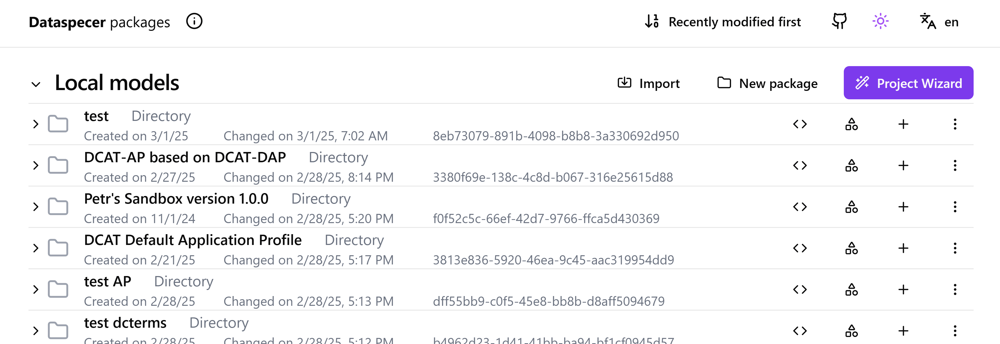

# Sample Dataspecer specifications
A repository for sample specifications from [Dataspecer](https://dataspecer.com), using the [Data Specification Vocabulary (DSV)](https://w3id.org/dsv#) for Application profile modeling.

- [DCAT 3 Default Application Profile](https://mff-uk.github.io/specifications/dcat-dap/), compare with the original [Data Catalog Vocabulary (DCAT) - Version 3](https://www.w3.org/TR/vocab-dcat-3/). You can see e.g. differences between [DCAT3.ttl](https://www.w3.org/ns/dcat3.ttl) and actual definitions in the document, and description of the application profile (reuse of properties from different vocabularies) in the attached DSV file.
  - [Complete DCAT 3 DAP Dataspecer project](https://mff-uk.github.io/specifications/dcat-dap/export.zip) (download and import as file).
- [DCAT-AP 3.0.1](https://mff-uk.github.io/specifications/dcat-ap/), compare with the original [DCAT-AP 3.0.1](https://semiceu.github.io/DCAT-AP/releases/3.0.1/). See the profiling hierarchy from DCAT-AP to DCAT-DAP (above).
  - [Complete DCAT-AP 3.0.1 Dataspecer project](https://mff-uk.github.io/specifications/dcat-ap/export.zip) (download and import as file).
- [DCAT-AP HVD 3.0.0](https://mff-uk.github.io/specifications/dcat-ap-hvd/), compare with the original [DCAT-AP HVD 3.0.0](https://semiceu.github.io/DCAT-AP/releases/3.0.0/). See the profiling hierarchy from DCAT-AP HVD to DCAT-AP to DCAT-DAP (above).
  - [Complete DCAT-AP HVD 3.0.0 Dataspecer project](https://mff-uk.github.io/specifications/dcat-ap-hvd/export.zip) (download and import as file).
- [Data Specification Vocabulary (DSV)](https://mff-uk.github.io/data-specification-vocabulary/dsv/)
- [Data Specification Vocabulary Default Application Profile (DSV-DAP)](https://mff-uk.github.io/data-specification-vocabulary/dsv-dap/)
- [DCAT-AP-CZ](https://ofn.gov.cz/dcat-ap-cz) (in Czech), reusing DCAT-AP -> reusing DCAT-DAP
- [DCAT-AP-CZ terms of use vocabulary](https://ofn.gov.cz/dcat-ap-cz-podmínky-užití/) (in Czech)
- [DCAT-AP-CZ dataset types](https://ofn.gov.cz/dcat-ap-cz-typy-datových-sad-dle-zdroje/) (in Czech)

You can either:
Import the spec to [Dataspecer](https://dataspecer.com) as is using import functionality and the spec URL, e.g. `https://mff-uk.github.io/specifications/dcat-ap/`, or create a new application profile of the spec.
